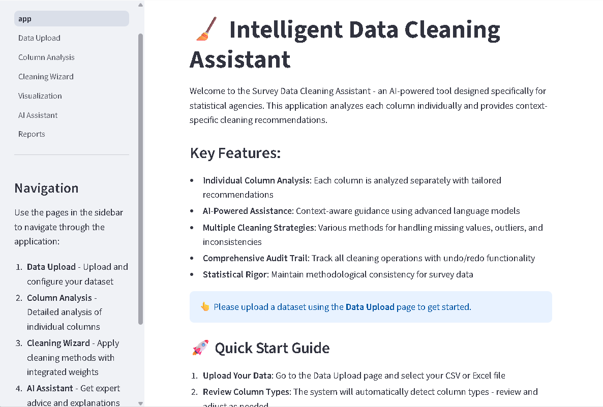
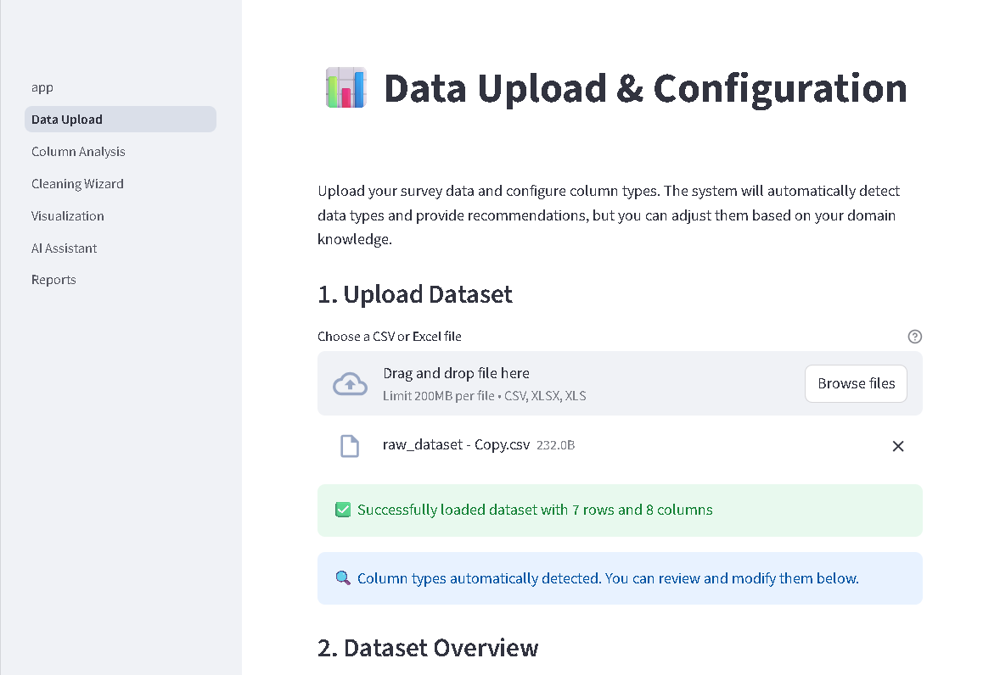
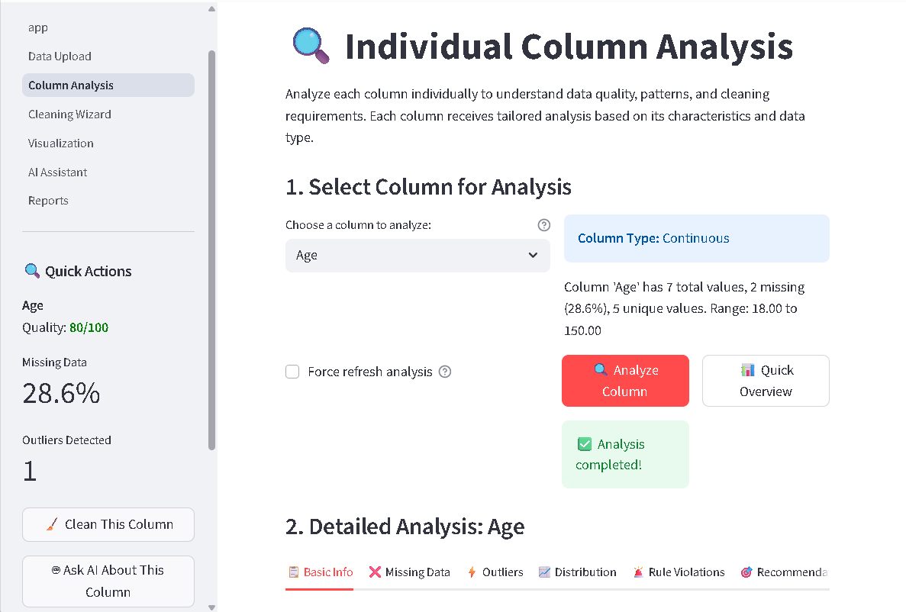
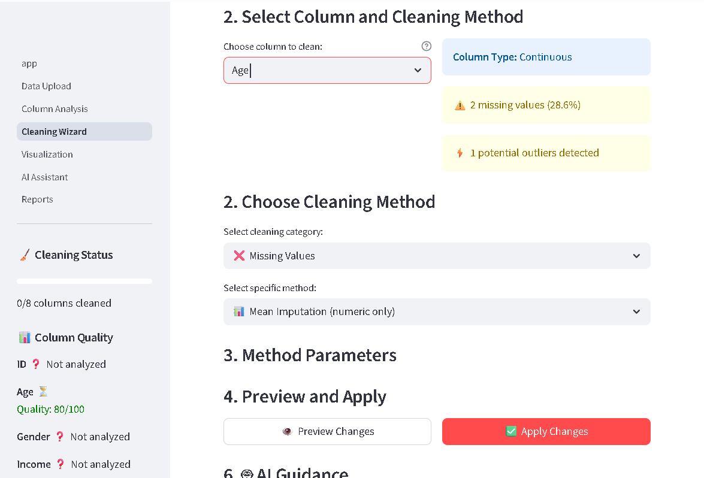
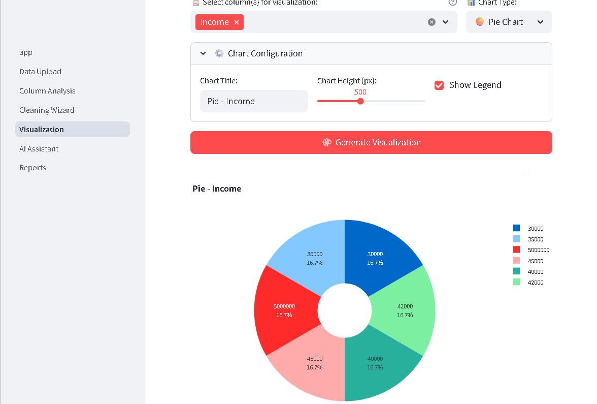
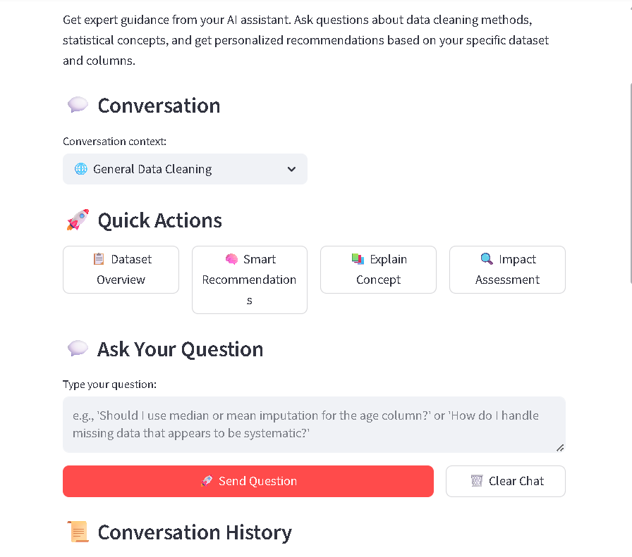

# 🧹 Intelligent Data Cleaning Assistant

> An AI-powered data cleaning platform designed specifically for statistical agencies and data professionals to streamline survey data preprocessing with column-specific recommendations and comprehensive audit trails.


## 🎯 Problem Statement

Statistical agencies and data scientists spend up to 80% of their time cleaning and preparing data. Traditional tools either:
- Provide generic, one-size-fits-all solutions that ignore column-specific characteristics
- Lack transparency in cleaning operations, making it hard to maintain audit trails
- Don't consider survey methodology and sampling weights
- Require extensive programming knowledge

**Our solution**: An intelligent, context-aware data cleaning assistant that analyzes each column individually and provides tailored recommendations while maintaining complete transparency and statistical rigor.

## ✨ Key Features

### 🎯 Column-Specific Intelligence
- **Individual Column Analysis**: Each column is analyzed separately based on its unique characteristics (data type, distribution, missing patterns)
- **Context-Aware Recommendations**: AI-powered suggestions tailored to specific data issues detected in each column
- **Smart Type Detection**: Automatically identifies numeric, categorical, binary, ordinal, and text columns

### 🤖 AI-Powered Assistance
- **Conversational Interface**: Ask questions about your data and get expert-level guidance
- **Method Comparison**: Compare different cleaning strategies with pros/cons for your specific use case
- **Impact Assessment**: Understand how each cleaning operation will affect your data and analysis
- **Educational Explanations**: Learn statistical concepts as you clean your data

### 🔧 Comprehensive Cleaning Tools

#### Missing Value Handling
- Mean/Median/Mode Imputation
- Forward/Backward Fill
- KNN Imputation
- Interpolation methods
- Deletion strategies (listwise/pairwise)

#### Outlier Detection & Treatment
- Multiple detection methods (IQR, Z-score, Modified Z-score, Isolation Forest)
- Consensus-based outlier identification
- Treatment options: removal, winsorization, capping, transformation

#### Data Quality Assessment
- Automated quality scoring (0-100)
- Issue detection and prioritization
- Pattern recognition in missing data
- Distribution analysis (skewness, kurtosis)

### 📊 Advanced Capabilities
- **Survey Weights Integration**: Properly handle sampling weights in cleaning operations
- **Undo/Redo Functionality**: Complete audit trail with ability to revert operations
- **Interactive Visualizations**: Distribution plots, outlier detection, correlation analysis
- **PDF Report Generation**: Comprehensive documentation of all cleaning operations
- **Configuration Export/Import**: Save and reuse cleaning workflows

## 🏗️ Architecture

### Tech Stack
- **Frontend**: Streamlit (Multi-page application)
- **Data Processing**: Pandas, NumPy
- **Statistical Analysis**: SciPy, scikit-learn
- **Visualization**: Matplotlib, Seaborn, Plotly
- **AI Integration**: Groq API (Llama 3.1)
- **Reporting**: ReportLab

### Project Structure
```
📦 intelligent-data-cleaning-assistant
├── 📄 app.py                    # Main application entry
├── 📂 modules/                  # Core functionality
│   ├── ai_assistant.py          # AI recommendation engine
│   ├── cleaning_engine.py       # Data cleaning operations
│   ├── data_analyzer.py         # Statistical analysis
│   ├── report_generator.py      # PDF generation
│   ├── survey_weights.py        # Survey methodology
│   ├── utils.py                 # Helper functions
│   └── visualization.py         # Plotting utilities
├── 📂 pages/                    # Multi-page interface
│   ├── 1_Data_Upload.py         # File upload & configuration
│   ├── 2_Column_Analysis.py     # Column-by-column analysis
│   ├── 3_Cleaning_Wizard.py     # Cleaning operations
│   ├── 4_Visualization.py       # Data visualization
│   ├── 5_AI_Assistant.py        # AI chat interface
│   └── 6_Reports.py             # Report generation
└── 📄 requirements.txt          # Dependencies
```

## 🚀 Getting Started

### Prerequisites
- Python 3.11 or higher
- pip package manager

### Installation

1. **Clone the repository**
```bash
git clone https://github.com/yourusername/intelligent-data-cleaning-assistant.git
cd intelligent-data-cleaning-assistant
```

2. **Install dependencies**
```bash
pip install -r requirements.txt
```

3. **Set up API key (Optional - for AI features)**
```bash
export GROQ_API_KEY='your-groq-api-key-here'
```
Get your free API key at [console.groq.com](https://console.groq.com)

4. **Run the application**
```bash
streamlit run app.py
```

The application will open in your browser at `http://localhost:8501`

## 📖 Usage Guide

### Step 1: Upload Your Data
- Navigate to **Data Upload** page
- Upload CSV or Excel file (supports .csv, .xlsx, .xls)
- System automatically detects column types

### Step 2: Review & Configure
- Verify auto-detected column types
- Adjust types if needed (continuous, categorical, binary, ordinal, text)
- Configure survey weights (optional)

### Step 3: Analyze Columns
- Use **Column Analysis** to examine each column
- View statistics, missing patterns, outliers, quality scores
- Get specific insights for each column's characteristics

### Step 4: Clean Your Data
- Go to **Cleaning Wizard**
- Select column to clean
- Choose appropriate methods based on AI recommendations
- Apply operations with real-time preview
- Use undo/redo to refine your approach

### Step 5: Visualize & Validate
- Explore **Visualization** page for interactive plots
- Compare before/after distributions
- Validate cleaning effectiveness

### Step 6: Get AI Guidance (Optional)
- Use **AI Assistant** for expert advice
- Ask questions like:
  - "What's the best way to handle missing values in the 'income' column?"
  - "Compare median imputation vs KNN imputation for my age variable"
  - "What impact will removing outliers have on my analysis?"

### Step 7: Generate Reports
- Create comprehensive **PDF Reports**
- Document all cleaning operations
- Export configuration for reproducibility

## 🎨 Screenshots

### Main Dashboard


### Data Upload


### Column Analysis


### Cleaning Wizard


### Visualization


### AI Assistant


## 🧪 Example Use Cases

### 1. Survey Data Preprocessing
Statistical agencies can clean census or survey data while maintaining sampling weights and methodological integrity.

### 2. Research Data Quality Control
Researchers can ensure data quality with transparent, reproducible cleaning workflows and comprehensive audit trails.

### 3. Business Analytics
Data analysts can prepare datasets for analysis with intelligent outlier detection and missing value handling.

## 🔬 Technical Highlights

### Intelligent Outlier Detection
- **Consensus Approach**: Uses multiple methods (IQR, Z-score, Modified Z-score, Isolation Forest) and identifies consensus outliers
- **Severity Grading**: Classifies outliers as low, medium, or high severity
- **Method-Specific Results**: Shows which methods flagged each outlier for informed decision-making

### Context-Aware AI Recommendations
- **Issue Detection**: Automatically identifies specific problems (missing values, outliers, skewed distributions, rule violations)
- **Tailored Solutions**: Provides specific methods and parameters based on detected issues
- **Reasoning**: Explains why each method is recommended for the specific column characteristics

### Survey Methodology Integration
- **Sampling Weights**: Properly handles design weights in all cleaning operations
- **Methodological Consistency**: Ensures cleaning operations don't violate survey methodology principles
- **Statistical Rigor**: Maintains data integrity for official statistics

## 🚀 Future Enhancements

- [ ] Support for more file formats (JSON, Parquet, SQL databases)
- [ ] Advanced rule-based validation with custom constraints
- [ ] Automated workflow scheduling for recurring data cleaning
- [ ] Multi-user collaboration features
- [ ] Integration with popular data science platforms
- [ ] Real-time data cleaning for streaming data
- [ ] Advanced NLP for text column cleaning
- [ ] Custom plugin architecture for domain-specific cleaning

## 🤝 Contributing

Contributions are welcome! Please feel free to submit a Pull Request. For major changes, please open an issue first to discuss what you would like to change.

1. Fork the repository
2. Create your feature branch (`git checkout -b feature/AmazingFeature`)
3. Commit your changes (`git commit -m 'Add some AmazingFeature'`)
4. Push to the branch (`git push origin feature/AmazingFeature`)
5. Open a Pull Request

## 📝 License

This project is licensed under the MIT License - see the [LICENSE](LICENSE) file for details.

## 👥 Team

Built with ❤️ for statistical agencies and data professionals worldwide.

## 🙏 Acknowledgments

- Special thanks to the statistical agency community for feedback and use cases
- Built with Streamlit framework
- AI powered by Groq's Llama 3.1 model
- Inspired by the challenges faced by data scientists in survey data preprocessing

## 📧 Contact

For questions, feedback, or collaboration opportunities:
- Create an issue in this repository
- Email: your-email@example.com

---

⭐ If you find this project useful, please consider giving it a star!

**Made for Hackathon 2025** | Empowering data professionals with intelligent cleaning tools
